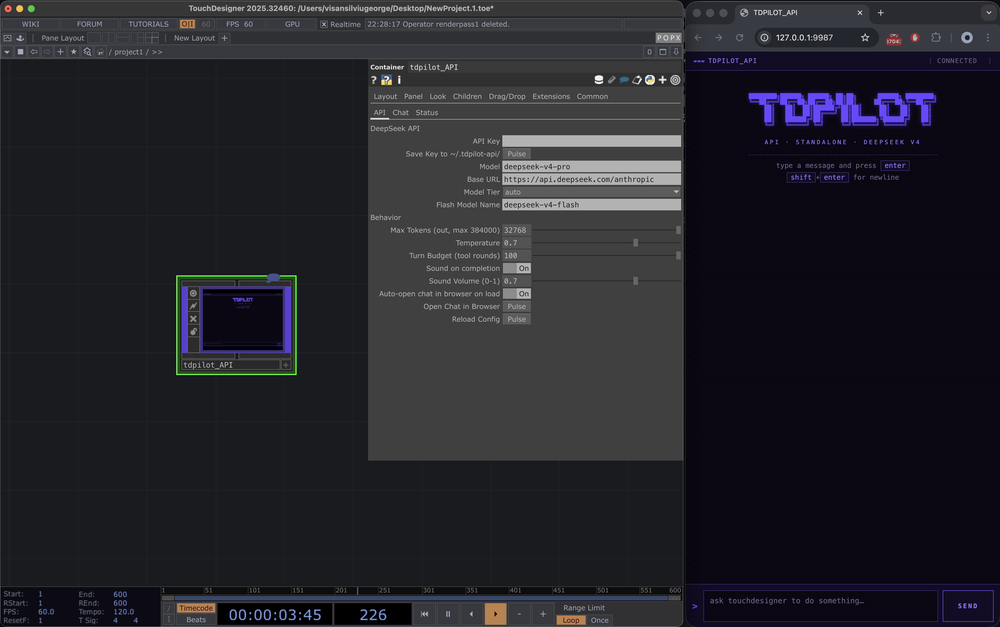

```
████████╗██████╗ ██████╗ ██╗██╗      ██████╗ ████████╗
╚══██╔══╝██╔══██╗██╔══██╗██║██║     ██╔═══██╗╚══██╔══╝
   ██║   ██║  ██║██████╔╝██║██║     ██║   ██║   ██║
   ██║   ██║  ██║██╔═══╝ ██║██║     ██║   ██║   ██║
   ██║   ██████╔╝██║     ██║███████╗╚██████╔╝   ██║
   ╚═╝   ╚═════╝ ╚═╝     ╚═╝╚══════╝ ╚═════╝    ╚═╝
```

# TDPilot — DeepSeek v4 · v2.5.1

[](https://github.com/dreamrec/TDPilot_deepseekv4/actions/workflows/ci.yml)
[](https://www.npmjs.com/package/tdpilot-dpsk4)
[](https://www.npmjs.com/package/tdpilot-dpsk4)
[](./LICENSE)
[](./pyproject.toml)
[](./docs/MANUAL.md)
[](https://derivative.ca)
[](https://deepseek.com)

An AI assistant that lives inside TouchDesigner. It can inspect your network, build new operators, wire them up, debug errors, take screenshots, remember things between sessions, replay successful patterns, surface relevant memories before each turn, batch tool calls, recover from failures with actionable hints, and survive long conversations via context compaction.

## How to install — pick a path

Two ways to run it. They coexist in the same TD project if you want both.

| | **Standalone .tox** | **Claude Code CLI** |
|---|---|---|
| **Install effort** | Drag one file in, paste a key. | Install Claude Code, install the plugin, configure MCP. |
| **Where chat lives** | Browser tab + a panel inside TD. | Your Claude Code terminal. |
| **Tools** | 95 curated for in-TD use | 109 (full surface) |
| **Best for** | Live performance, quick patches, demos, "no setup" use | Heavy multi-file projects, long sessions, full Claude Code ecosystem |
| **TD port** | 9987 | 9985 + 9986 |
| **Config dir** | `~/.tdpilot-api/` | `~/.tdpilot-dpsk4/` |

**Start here.** If you just want to chat with TouchDesigner → **standalone `.tox`** (drop-in, two minutes). If you already use Claude Code → **Claude Code CLI**. If you want MCP in some other client (Cursor, Continue, custom integrations) → the same npm package, `npx tdpilot-dpsk4`, exposes the MCP server standalone. Jump straight to [`docs/MANUAL.md`](docs/MANUAL.md) for the deep reference, or read on for the install walkthroughs.

<details>
<summary><b>Release highlights — v2.5.0 (May 19, 2026)</b> (click to expand)</summary>

**v2.5.0** — agent self-awareness + safety + distribution polish. Eight phases shipped: activity log + journal hints (v2.5.1), OCR sidecar (v2.5.2), tool approval gates (v2.5.3), auth env→file migration (v2.5.4), TD 2025.32820 release card (v2.5.5), stdio discipline contract (v2.5.6), `td_check_for_updates` (v2.5.7), trace viewer (v2.5.8). **Tool count 105 → 109.** 4 new MCP tools: `td_get_activity_log`, `td_ocr_image`, `td_check_for_updates`, `td_get_traces`. New `Approvalmode` Menu COMP param gates destructive tools (`td_exec_python`, `td_delete_node`, etc.) with a chat-banner click-through (30 s timeout). 2099 tests passing (+99 from v2.4 baseline).

<details>
<summary>Earlier — v2.4.0 (May 13, 2026)</summary>

**v2.4.0** — multi-phase release covering Phase A (zero-risk MCP additions), Phase B (vision pipeline + auth wizard + `content_type` on memory entries), and most of Phase C (per-session cost tracking, `td_midi_devices`, circuit breaker, configurable thinking budget, featured-prompts chip row), plus a same-day live-debug stack closing **10 bugs (B-001 .. B-010)** surfaced while running the canonical failing prompt _"Build a kaleidoscope feedback loop"_ end-to-end. **Tool count 93 → 105.**

Headline live-debug fixes:

- **Smarter model router** (B-008-A) — auto-tier heuristic now scores structural-complexity nouns (`feedback`, `loop`, `chain`, `network`, `pipeline`, `kaleidoscope`, ...) on top of imperative verbs. Short prompts like _"Build a kaleidoscope feedback loop"_ now score 2 and route to **pro** instead of failing on flash.
- **Task-sticky pro** (B-008-T) — once auto-routing picks pro for the start of a task, sticky-pro holds the tier across follow-up clarifications until the user signals task done ("thanks", "done", "that works", "ship it"). Mixed messages ("thanks, now also fix Y") deliberately keep sticky via negative lookahead.
- **Reactive cycle escalation** (B-008-C) — `run_turn` catches `CycleDetected` and arms a one-shot pro promotion; combined with B-008-T, this means a stuck flash turn → next turn pro → sticky-pro for the remainder of the recovery.
- **False 'idle (timeout)' fix** (B-009) — three-layer fix for the long-pro-thinking watchdog: backend heartbeat thread pulses `EV_STATE("thinking")` every 30s during a blocking `urlopen`, frontend `TURN_END_SAFETY_MS` bumped 90s → 240s, and `applyMessage` auto-recovers from a false timeout when a tool call arrives.
- **Cycle-detector list-order evasion closed** (B-010) — `args_hash` now recursively canonicalizes nested list elements, so `modes=['a','b']` and `modes=['b','a']` correctly count as the same identity.
- **Plus 5 wiring/resilience fixes** — chat-pipe schema gap (B-001), TD THREAD CONFLICT during sticky-tier write (B-003), model-badge WS broadcast restored (B-004), `AgentError` name-match across TD module reloads (B-005), and a new system-prompt rule against identical-arg probe loops (B-007).

**Live verification** — the canonical failing prompt was retested end-to-end on 2026-05-13:
- Routed pro from turn 1; sticky-pro held across 30+ debug turns
- Two clean cycle-detect events forced strategy switches
- Agent self-diagnosed the actual numerical bug: per-frame decay `0.85 × 0.9 = 0.765` was too aggressive for visible feedback accumulation; shipped `0.95/frame` for smooth trails
- 174 chat rows, 118K in / 27K out / **59 cache hits / 0 misses / $0.062 total**

See [CHANGELOG](CHANGELOG.md#240---2026-05-13) for the full v2.4.0 details, or [v2.3.0](CHANGELOG.md#230---2026-05-11) for the prior bilateral-audit release (9 bugs + scoped snapshot tools).

</details>

See [CHANGELOG](CHANGELOG.md#250---2026-05-19) for the full v2.5.0 details.

</details>

---

## Standalone .tox — first-time install (Mac, Windows, Linux)

### What you need

- TouchDesigner 2025.30000 or newer.
- A DeepSeek API key. Get one at [platform.deepseek.com](https://platform.deepseek.com/) — pay-as-you-go, no subscription. v4-flash is cheap; v4-pro is fine for serious work.
- A modern browser. Chrome, Edge, Firefox, Safari — any of them work.

### Step-by-step

**1. Drop the .tox into your project.**
Open TouchDesigner. Drag `td_component/tdpilot_API.tox` from this repo into your network. It lands at `/project1/tdpilot_API` — a purple containerCOMP about 900×600.

**2. Paste your API key.**
Click on the COMP to open its parameters (right side panel, or hit `p`). On the **API** page, find `Api Key`, paste your DeepSeek key, then click `Save Key to ~/.tdpilot-api/`. The key is written to `~/.tdpilot-api/config.json` with restricted permissions on macOS/Linux.

You only do this once — TDPilot reads the key from that file on every load.

**3. Open the chat.**
Click `Open Chat in Browser`. A new tab opens at `http://127.0.0.1:9987/` with the chat UI. The same chat is also rendered inside the COMP's panel — viewer toggle on the COMP shows it natively in TD.



**4. Say hi.**
Type something simple — "what's the project's FPS?" or "list the operators in /project1". The agent answers, calls tools as needed, shows them inline, and ends with a text reply. The chime at the end means it's done.

That's it. You're chatting with TouchDesigner.

### What the parameters control

The COMP has three parameter pages:

**API page** — model + budget settings. Most you can leave alone:

| Param | Default | What it does |
|---|---|---|
| `Api Key` | empty | Your DeepSeek key. |
| `Model` | `deepseek-v4-pro` | Pro tier model. Smarter, slightly slower. |
| `Flash Model Name` | `deepseek-v4-flash` | Flash tier. Cheaper, snappier on lookup-style prompts. |
| `Model Tier` | `auto` | `auto` routes per turn (long/code-heavy → pro, short lookups → flash). Or pin `flash` / `pro` manually. |
| `Max Tokens` | `32768` | Output budget per call. Crank to 384000 if you want long-form replies. |
| `Temperature` | `0.7` | Sampling temperature. Lower = more deterministic. |
| `Turn Budget` | `100` | Max tool-use rounds before the loop hard-stops. |
| `Sound on completion` | on | Plays a chime when the agent finishes a turn. Toggle off if you're recording or in a quiet space. |
| `Sound Volume` | `0.7` | 0.0 (silent) to 1.0 (loud). |
| `Auto-open chat in browser on load` | on | Opens `http://127.0.0.1:9987/` automatically when the .tox loads. |

**Chat page** — the controls you reach for during a session:

| Param | What it does |
|---|---|
| `Send` | Pulse to send the current message. Same as the Send button in the browser. |
| `Stop` | Pulse to interrupt the agent mid-turn. |
| `Reset` | Pulse to clear the conversation and start fresh. |

**Status page** — read-only:

| Param | What it shows |
|---|---|
| `Status` | `idle` / `thinking` / `tool` / `error` |
| `Last Tool` | The last tool the agent called. |
| `Active Model` | Which tier (flash/pro) the auto router picked for the most recent turn. |

### Sound

The completion chime is on by default. macOS plays `Glass.aiff`, Linux uses `paplay`, Windows uses the built-in beep API. Volume is the `Sound Volume` slider on the API page. To kill it entirely, untoggle `Sound on completion`.

### Browser chat

Default URL: `http://127.0.0.1:9987/`. The chat reconnects automatically if you reload the page or close and reopen the tab. Multiple tabs can follow the same session — open the URL on a phone or second monitor and they all stream the same conversation. The `Stop` button in the browser does the same thing as the COMP's `Stop` parameter.

If the browser tab shows nothing on first load, give it a second — the embedded webserver takes a frame to start. If it stays blank, click `Open Chat in Browser` once on the COMP to force a fresh open.

---

## Claude Code CLI — first-time install

If you already use Claude Code and want the full 105-tool surface plus the plugin marketplace ecosystem:

**1. Install Claude Code.**
Follow the [Claude Code install docs](https://docs.claude.com/en/docs/claude-code).

**2. Configure DeepSeek as your backend.**
Set `ANTHROPIC_BASE_URL=https://api.deepseek.com/anthropic` and `ANTHROPIC_MODEL=deepseek-v4-pro` in your environment.

**3. Install the plugin.** One of these three:

```
/plugin marketplace add dreamrec/TDPilot_deepseekv4
/plugin install tdpilot-dpsk4@dreamrec-TDPilot_deepseekv4
```

```
npx tdpilot-dpsk4 plugin-install
```

Or paste this `.mcp.json` block into your project root:

```json
{
  "mcpServers": {
    "touchdesigner-dpsk4": {
      "command": "uv",
      "args": ["run", "--directory", "${workspaceFolder}", "tdpilot-dpsk4"],
      "env": {
        "TD_MCP_HOST": "127.0.0.1",
        "TD_MCP_PORT": "9985",
        "TD_MCP_WS_PORT": "9986"
      }
    }
  }
}
```

**4. Drop the bridge .tox into TouchDesigner.**
Drag `td_component/tdpilot-dpsk4.tox` into your TD `/local` container. Or run the auto-installer panel inside the .tox.

**5. Talk to TD from your Claude Code terminal.**
The 105 tools, 3 skills (`tdpilot-dpsk4-core`, `tdpilot-dpsk4-production`, `popx-touchdesigner`), and 2 slash commands (`/td-check`, `/td-snapshot`) are now available.

---

## Standalone vs CLI — when to pick which

Both variants run on the same DeepSeek backend and share the same TD-side handler layer. The difference is **where the chat lives** and **how much surface you want**.

**Pick the standalone .tox if:**
- You want to chat *while* you patch — alt-tab between the browser and your TD viewport.
- You're doing live performance and need the agent in the same window as your visuals.
- You're showing it to someone — drag-drop demo with no terminal involved.
- You want zero CLI dependencies. No Node, no uv, no Claude Code install.
- You like the chat panel rendering inside TD's UI itself.

**Pick the Claude Code CLI if** you're already using Claude Code, want long sessions across TD + non-TD code, or need any of the 15 tools that only exist on the CLI:

| Category | What the CLI exclusively gives you | Tools |
|---|---|---|
| **Typed patch sessions** | Plan a multi-step build, dry-run it, apply it, validate, generate variations — wrapped in a typed `PatchPlan` value with atomic rollback on failure. | `td_plan_patch`, `td_preflight_patch`, `td_patch_apply`, `td_patch_validate`, `td_patch_variations` |
| **Streaming output** | Push live TOP frames over WebSocket to a client at controllable FPS. | `td_stream_top`, `td_stop_stream_top` |
| **Continuous vision monitoring** | Watch a TOP over time — alpha coverage, luminance, dominant color, ROI diff between frames. | `td_monitor_visual`, `td_capture_and_analyze` |
| **Visual optimization** | Suggest improvements to a render based on weighted objectives (stability vs complexity). | `td_optimize_visual` |
| **Advanced memory** | Auto-extract a recipe from a live network, replay it elsewhere, promote project techniques to global. | `td_memory_learn`, `td_memory_replay`, `td_memory_promote` |
| **Macros & planning advanced** | Author macros from templates programmatically. | `td_create_macro` |
| **Slash commands** | One-keystroke `/td-check` (project health) and `/td-snapshot` (safety snapshot). | `/td-check`, `/td-snapshot` |
| **Plugin marketplace + skills** | Auto-activating skills for TD work; full Claude Code skill ecosystem available alongside. | `tdpilot-dpsk4-core`, `tdpilot-dpsk4-production`, `popx-touchdesigner` |

**Now in BOTH variants** (Tier 1+2 ports landed in the standalone): official-docs lookup (5 tools), TD 2025 native introspection (6 tools), recommendations (3 tools), server introspection (3 tools), audit/validate utilities (2 tools), memory export/import/favorite (3 tools).

**Standalone-exclusive runtime improvements** (shipped post-1.6.11, see [CHANGELOG](CHANGELOG.md)):

| Capability | What it does |
|---|---|
| **Cache-stable dynamic context** | Volatile per-turn state (memory / knowledge / recipes indexes) lives in a synthetic message slot so the system prompt prefix stays byte-stable — DeepSeek's auto-cache hits at ~50× discount |
| **SQLite/FTS corpus support** | `knowledge_search` / `td_search_official_docs` now work against `*brain.db` files installed via `npx tdpilot-dpsk4 brains add <corpus>`, alongside the legacy `pages.jsonl` path |
| **Pre-turn retrieval injection** | Top memory / recipe / knowledge hits surface as ambient context before each turn, no tool round-trip needed |
| **Trigger-based skill loading** | A user message containing `popx` / `slow` / `fps` / etc. auto-loads the matching skill body for the rest of the session |
| **Trust-tier-aware results** | Every search hit carries `trust_tier` (`official` > `bundled` > `personal` > `community` > `transcript` > `experimental`); the agent weights evidence and validates community/transcript hits before claiming behaviour as fact |
| **Severity-tracked validation hints** | High-severity mutations (create_node, exec_python, …) without a follow-up `td_get_errors` get a soft nudge in the chat — informational, never blocks |
| **Failure recovery hints** | 14 known error patterns ("Unknown operator type", "THREAD CONFLICT", 401, "corpus not installed", v2.1.1's `td.Par.rawVal` / renderTOP attr typos / `tdu.Matrix.translation` / `ParCollection.children`, …) attach an actionable `recovery_hint` so the agent doesn't retry the same failed call 3× |
| **`tool_batch`** | Run up to 8 independent tool calls in one round trip instead of N — saves model→server→model latency on chained reads |
| **Per-turn observability traces** | `~/.tdpilot-api/traces/<YYYY-MM-DD>.jsonl` captures timing + tool calls + outcomes per turn (user text + args hashed for privacy); read via `td_get_recent_traces` |
| **Conversation compaction** | At 20+ messages the oldest portion summarises into one synthetic assistant message; recent 10 turns kept verbatim with their original thinking-block signatures intact; full history forensically preserved at `~/.tdpilot-api/history/` |
| **First-run wizard** | The chat panel polls `/firstrun` and renders a 3-step quickstart checklist (paste key → install brain → save first memory) until completion |
| **Doctor `--live`** | `python3 scripts/doctor_live.py [--deep]` probes webserver health, key validity, brain inventory, memory + user-tool dirs |

The standalone has 95 tools that cover the everyday inspect → build → wire → verify loop, plus persistent memory, knowledge corpus, recipes, snapshots, subagents (parallel fan-out), multi-model routing (auto/flash/pro), macros, user-pluggable tools (drop a `.py` in `~/.tdpilot-api/tools/`), official-docs lookup against the derivative corpus, TD 2025 runtime introspection (Python env, threading, color pipeline), and project-audit + recipe-validation utilities.

**Run both at the same time.** The two .tox files coexist in the same TD project — different ports, different config dirs, different COMP names. Standalone in the browser for quick chat, CLI in the terminal for heavy work.

---

## What's new since v1.5.x

The line from v1.5.0 (Apr 25, 2026) to v2.4.0 (May 13, 2026) shipped in tight bursts. Most important updates, newest first:

| Version | Date | Headline |
|---|---|---|
| **v2.4.0** | May 13 | **v2.4 phase release + same-day live-debug stack.** Phase A (zero-risk MCP additions: `tool_batch`, `td_get_capabilities_summary`, retry-with-backoff, extended `td_cooking_info` sort_by enum, `on_hint` UI surface), Phase B (screenshot vision pipeline with `image` block injection, first-run auth wizard with `Authmode=token` default, `content_type` field distinguishing instruction/reference/fact on memory/knowledge/recipe entries), and most of Phase C (per-session cost tracking with footer pill + over-$1 escalation styling, `td_midi_devices` + MIDI hint pack, circuit breaker, configurable thinking budget, featured-prompts chip row; DMX C.1 deferred to v2.5). Plus 10 live-debug fixes (B-001..B-010) surfaced while running _"Build a kaleidoscope feedback loop"_ end-to-end — including a smarter auto-tier router that adds structural-complexity nouns to the scoring signal so short imperative-build prompts route to pro; task-sticky pro that holds the tier across the entire multi-turn build until the user signals done; reactive cycle-escalation latching sticky-pro for recovery efforts; three-layer false-`idle (timeout)` fix (backend heartbeat + 240s timeout + auto-recovery on proof-of-life); `args_hash` deep-canonicalization closing the list-order cycle-detect evasion; and the wiring/resilience cluster (chat-pipe schema gap, TD THREAD CONFLICT during sticky-tier write, EV_MODEL broadcast restoration, `AgentError` name-match across TD module reloads, new system-prompt rule against identical-arg probe loops). Live-verified: canonical failing prompt now succeeds in 174 rows with smooth-trail feedback, 59 cache hits / 0 misses, $0.062 total. Tool count 93 → 105. PR #44. |
| **v2.3.0** | May 11 | **Bilateral-audit release.** Closes 9 confirmed bugs uncovered by a deep end-to-end audit of the live `tdpilot_API` chat tox against a real DeepSeek session. The headline cluster: TD 2025.32820/macOS flattens HTTP headers with ORIGINAL CASE (`X-TDPilot-Token`, not lowercase) on direct `request` keys — pre-fix `_headers()` did case-sensitive lookup, silently disabling the entire v1.7.1 auth + CORS + JSON-envelope stack. Plus: inbox drain race fix (frame-level retry in `DrainEvents`), agent over-eager tool use gate (16-char retrieval floor + length-relative bm25 threshold + new "User-intent gate" paragraph in `SYSTEM_PROMPT_BASE`), WebSocket keepalive (client-driven `{"type":"ping"}` every 5s, server tracks `last_seen`, age-out at 15s), strict `{"message": ...}` type validation (null/dict/int/bool now 400 instead of silently `str()`-coerced), Chromium stuck-404 fix (favicon→204 + `Cache-Control: no-store` + `onServerStart` auto-reload of `chat_web`), Authmode default flipped `"open"`→`"token"`, WS path-segment auth, double-status-idle dedupe. **New feature**: `snapshot_save_scoped` / `snapshot_restore_scoped` agent tools — JSON manifest of a scope's structural shape (excluding agent COMP), restorable mid-conversation via diff-and-apply (Bug 19). Tool count 91 → 93. PR #41. |
| **v2.2.0** | May 11 | **Phase 1 reliability foundation + drag-and-go UX.** First milestone of the v2.2→v3.0 roadmap. Auto-rollback (each LLM tool batch wrapped with a baseline-and-diff check against `td_get_errors` plus a TD `ui.undo.startBlock` — atomic revert + hint-to-agent on regression). Cycle detection (per-turn `(tool, args_hash) → count` ledger; default threshold 3 raises `CycleDetected` before the next dispatch). New `Authmode` Menu COMP param replaces the env-var auth toggle that didn't survive TD restarts. Auto-save + auto-reload when `Apikey` value changes (zero-pulse key onboarding). Build script auto-mirrors `.tox` from any worktree into the main repo's `td_component/` so drag-from-Finder is always fresh. PRs #34/#36/#37/#38/#39. |
| **v2.1.5** | May 10 | **Codex P2 follow-up on v2.1.4.** `isWorkingAgentState` now classifies `'idle <suffix>'` (e.g. `'idle (timeout)'` from the v2.1.4 safety timer) as non-working. Pre-2.1.5 the predicate only matched exact `'idle'` / `'ready'` / `'reset'` / `'connected'`, so the v2.1.4 timer's diagnostic suffix kept the pulse animation + Stop button visible after the timer fired. Functional path was unaffected (button re-enable worked); UI lied about state. |
| **v2.1.4** | May 10 | **Codex follow-ups on v2.1.3.** Two reliability holes the automated Codex review caught on PR #28: (P1) the new inbox queue now drains on `EV_ERROR` too — pre-2.1.4 a queued message after an errored turn sat in storage forever until a later successful turn happened to fire `EV_DONE`; (P2) the chat HTML's send-button gate now has a 90s safety timer + a `ws.onopen` reset, so a dropped WS connection between `/send` and the terminal status event no longer locks the user out of the chat permanently. |
| **v2.1.3** | May 9 | **Security hardening + chat-pipe queue + path harmonization.** Audit found a CSRF / drive-by RCE chain in `tdpilot_API.tox` (insecure-mode bypassed origin checks AND `EXEC_MODE=full` was hardcoded). Closed by always-on origin enforcement (insecure-mode bypasses only the token check), `EXEC_MODE` clamp to `restricted` whenever insecure-mode is active (opt back into full with `TDPILOT_API_ALLOW_INSECURE_FULL_EXEC=1`), `application/json` requirement on `/send` (forces CORS preflight for cross-origin POSTs), and a loud textport banner when insecure-mode is on. Rapid-`/send` message-drop bug fixed via FIFO inbox queue on `comp.storage` + chat HTML send-button gate on the runtime's turn-end signal (not on the fetch resolution). Chat-pipe storage namespaced under `~/.tdpilot-dpsk4/api/` with `~/.tdpilot-api/` legacy fallback in `resolve_user_dir`. |
| **v2.1.2** | May 9 | **Opt-in MCP auth.** `autostart.onStart()` no longer wipes persistent secrets; `TDPILOT_DISABLE_AUTH_BYPASS=1` opts into the env-file-driven shared-secret flow. |
| **v2.1.1** | May 9 | **Paused-TD UX trap + recovery hints + chat red mark.** `start_turn` now warns when `me.time.play=False` so a paused TD doesn't look like the agent is wedged on 60s tool-call timeouts. 4 new `recovery_hints` (`td.Par.rawVal`, renderTOP attr typos, `tdu.Matrix.translation`, `ParCollection.children`) harvested from a 184-message lighting-redesign turn. User messages in the chat now render with a high-contrast white-on-red `[USER]` stamp + thick red rule + red gradient. Parallel CI freshness gate added for `tdpilot_API.tox` so it can no longer silently go stale. |
| **v2.1.0** | May 8 | **Chat UI rework.** Quiet-mode toggle (`Cmd/Ctrl + .`) hides tool-call surfaces for prompts-only scrollback. Smaller default fonts. Contextual ASCII flourishes appended to assistant turn-ends (9-bucket topic-keyword pool). Plus the v2.0.0 audit fixes (patch session lifecycle, recovery hints, info-textDAT red ❌). |
| **v2.0.0** | May 8 | **Breaking + chat polish.** `is_tool_error_result()` requires the explicit `_tool_error` sentinel (legacy `"error"`-key fallback removed); `tdpilot_v1_3.tox` filename shim removed. New: small/large chat font-size toggle (`a` / `A`) at the far right of the status bar with `Cmd/Ctrl + +` / `-` shortcuts. Internal handlers unaffected — `recovery.attach_hint()` auto-stamps the sentinel; only external dispatcher integrations need to migrate. |
| **v1.10.0** | May 8 | `DeprecationWarning` cycle for v2.0's breaking change. One-release window for external dispatchers to migrate to the explicit sentinel before the fallback was removed. |
| **v1.9.0** | May 8 | **Measurement infrastructure (Phase 4).** Mock-DeepSeek for offline agent evals in regular CI, skill-prompt evals, ruff hardening floor (F841 + SIM118). |
| **v1.8.3** | May 8 | **God-module decompose.** 3149-line `mcp_webserver_callbacks.py` replaced by a focused split package at `td_component/callbacks/` with a build-time composer. Closes the last MED architectural finding from the v1.7.0 audit. |
| **v1.8.0** | May 8 | **Visual chat console.** The chat goes from terminal log to real UI: markdown rendering, collapsible tool calls, a token meter, scroll-aware autoscroll + keyboard shortcuts, inline screenshots. WS protocol picks up four new structured message types (`tool_call`, `tool_result`, `model`, `usage`). |
| **v1.7.2** | May 8 | Skills hygiene + content currency: YAML frontmatter validation surfaced via `td_skill_validate`. |
| **v1.7.1** | May 8 | **Security hotfix.** Standalone HTTP server now requires a per-launch session token (closes a cross-origin CSRF gap). Plus three chat-state-machine bugs from the post-1.7.0 audit. |
| **v1.7.0** | May 8 | **TouchDesigner 2025.32820 (May 2026) build support.** New operator knowledge for Trace POP, Triangulate POP, Layer Mix TOP, Render Simple TOP, NVIDIA RTX Video TOP, ST2110 In/Out, Pan Tilt CHOP, the DMX POP pipeline. Existing cards (Render TOP, Movie File In, Constant TOP, Noise TOP) refreshed for new params (3D textures, 2D arrays, render pulse, 4D noise derivatives, KTX2). **Migration trap: Polygonize POP is now 3D-only — for 2D inputs use Trace POP.** ZED operators now route through a central ZED TOP. |
| **v1.6.12** | May 7 | **Standalone runtime overhaul** — the biggest single release in the line. The "agent with a big prompt → small runtime with policies" shift. Cache-stable dynamic context (~50× DeepSeek cache discount), SQLite/FTS corpus support, pre-turn retrieval injection, trigger-based skill loading, trust-tier-aware results, failure recovery hints, `tool_batch` (up to 8 calls per round trip), conversation compaction, per-turn observability traces, first-run wizard. Tests 935 → 1122. |
| **v1.6.11** | May 4 | Port drift hotfix (9981/9982 → 9985/9986 across 17 files). DeepSeek v4 context-window + session-noise optimizations. |
| **v1.6.0** | May 2 | **Cockpit ergonomics.** Focus-aware tools, hint injection, scoped search, per-COMP notes. CLI tool count 99 → 103. |
| **v1.5.6** | May 2 | **One-button installer.** `tdpilot.tox` is now a self-installing container COMP — drag it in, the Install + Update panels do the rest. No Textport gymnastics, no shell scripts. |
| **v1.5.3** | Apr 25 | **Knowledge corpus.** Free-form markdown knowledge store as a parallel surface to technique memory; 4 new MCP tools to query/persist. |
| **v1.5.0** | Apr 25 | Schema migration (Phase 1) + monolithic `tool_registry.py` decomposed into 21 themed submodules (Phase 2). |

For per-release detail (including the v1.6.3–v1.6.9 panel-rendering saga, audit closures, and patches between major milestones) see [CHANGELOG.md](CHANGELOG.md). Pre-1.5.0 history is also preserved there.

---

## Repository layout

```
td_component/         TouchDesigner-side source (textDATs baked into the .tox)
  tdpilot_API.tox     Standalone .tox binary
  tdpilot-dpsk4.tox   CLI-bridge .tox binary
  build_tdpilot_api_tox.py   Build script for the standalone .tox
src/td_mcp/           DPSK4 MCP server (Python, 105 tools)
skills/               Claude Code skills (CLI plugin)
tests/                pytest suite (1848 tests + 12 agent-eval skeletons)
  agent_evals/        Live-integration evals (run with `pytest -m agent_eval`)
scripts/              Build + maintenance scripts
  doctor_live.py      Install doctor for the standalone (--deep probes DeepSeek)
  sync_counts.py      Keep README + MANUAL tool counts in sync with TOOL_SCHEMAS
  _chunk_schema_v1.py Shared chunk schema helpers used by every brain builder
docs/MANUAL.md        Full user manual (parameters, tools, troubleshooting, security)
docs/CHUNK_SCHEMA.md  Canonical chunk record format for brain.db files
docs/images/          Drop your own screenshots here
```

## Tests

```
uv run --extra dev pytest tests/
```

## License

MIT
